# Radar

Radar adds a compact, camera-oriented HUD radar for **Warhammer 40,000: Darktide**. It is built to surface the targets that matter most during live missions, nearby pickups, objective items, deployed support tools, environment interactables, expedition points of interest, teammates, and high-priority enemies, while keeping the presentation configurable from the mod options menu.

## What's New in 1.3.0

- Adds small **up** and **down** arrows for supported item markers, plus settings to control when the arrows appear and when vertically distant items are hidden.
- Fixes **Heretic Idol** markers so active idols show reliably on the radar.
- Adds anchor-based radar positioning with corner anchors plus horizontal and vertical offsets for more consistent placement across different screen layouts.
- Adds a **radar background opacity** slider and an optional **Infinite** boss marker range mode.
- Adds per-category **Icon size (%)** sliders, so you can resize major marker groups independently while keeping the final combined size capped at **4.0x**.

## Feature Overview

- Tracks nearby pickups, materials, mission items, event items, deployables, environment interactables, expedition POIs, teammates, and priority enemies on a single radar.
- Projects markers relative to your current facing, so the radar rotates with your view instead of acting like a fixed minimap.
- Supports **square** and **circle** radar frames, plus configurable **outline** and **guide** styles for both shapes.
- Lets you adjust **radar size**, **scan range**, **radar background opacity**, **vertical arrow range**, **vertical hide threshold**, and **maximum marker count**.
- Supports optional **icon scaling with radar size**.
- Adds per-category **Icon size (%)** sliders for common pickups, materials, objective items, expedition markers, deployables, enemies, players, event items, and debug markers.
- Supports separate marker styles for **enemies** and **teammates**. Enemies support **Icon only** and **Marked icon**, teammates support **Icon only**, **Marked icon**, **Dot only**, and **Marked dot**.
- Includes a **toggle radar on or off** keybind, so you can hide or restore the radar during a mission without opening the options menu.
- Supports anchor-based **radar positioning** with **Radar anchor**, **Horizontal offset**, **Vertical offset**, **Steps per input**, and dedicated movement keybinds for nudging the radar **left**, **right**, **up**, or **down**.
- Adds small **up** and **down** arrows to supported item markers when they are above or below you and still within the configured arrow range.
- Lets you hide supported item markers that are far above or below your current level, which helps reduce clutter in multi-level areas.
- Adds dedicated **Expedition POI** support for numbered **Sites of Interest** opportunity markers, plus dedicated icons for **Deadsider Sanctuaries**, **Data Reliquary Harvesters**, **Main Objective**, **Valkyrie Extraction Zone**, and **Valkyrie Arrival Zone**, with an option to ignore the normal range limit for these markers.
- Adds environment markers for **Medicae Station**, **Power Socket**, and **Heretic Idol**, and active heretic idols now appear reliably on the radar.
- Supports per-marker display mode dropdowns for supported artwork-based markers with **Artwork**, **Icon**, and **Off** modes. **Artwork** remains the default, and older boolean settings are migrated automatically.
- Recolors the remaining formerly white pickup icons with more semantic colors, including ammo, grenades, medicae-related markers, power sockets, and heretic idols.
- Keeps the radar position clamped to the visible UI space, so moving or resizing it does not push it off-screen.
- Colors the radar center dot from the local player HUD slot color.
- Supports class-icon and dot-based teammate presentations instead of a single fixed teammate marker style.
- Adds an optional **Infinite** boss marker range mode, which is especially useful for expeditions.
- Exposes category-based checkboxes, style dropdowns, display mode dropdowns, and group-based icon size sliders for common pickups, materials, objective items, expedition items, expedition POIs, environment markers, deployed items, enemies, teammates, event items, and debug markers.
- Includes optional **debug logs** and an **unknown pickups** toggle for discovery and troubleshooting.
- Includes a groundwork **highlighting** option, but the actual highlighting behavior is currently still under development.

## In-Game Radar Examples

The screenshots below show both radar styles during an expedition mission. They illustrate the camera-oriented layout, mixed pickup categories, teammate markers, expedition POIs, and priority targets in live gameplay.

### Circle Radar

  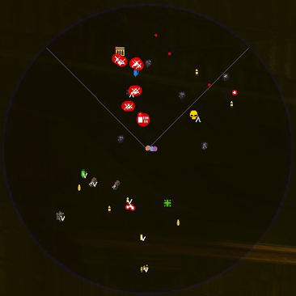
  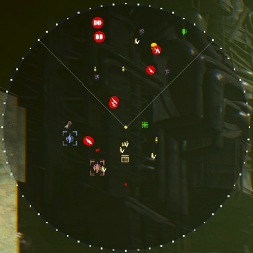
  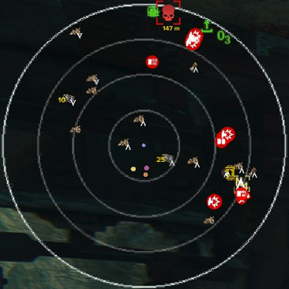

### Square Radar

  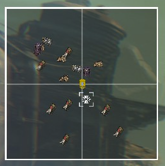
  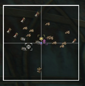
  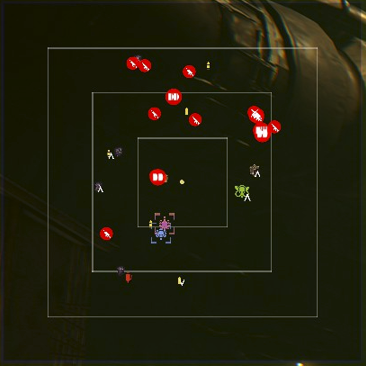

### Vertical item arrows

The new vertical item arrows add a small **up** or **down** overlay to supported item markers when the item is on a different level but still close enough horizontally to matter. You can also tune when these arrows appear and when vertically distant items are hidden entirely.

  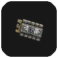
  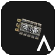
  

## Display and Behavior

Both radar shapes support the same outline and guide options, and the frame rendering is tuned so crosshairs fit the active frame, view guides reach the border cleanly, circle range rings stay thin and solid, circle outlines remain visually continuous, and square dotted outlines render as proper dots.

### Square radar variants
| Guide | Solid | Dotted | Off |
|---|---|---|---|
| Crosshair | 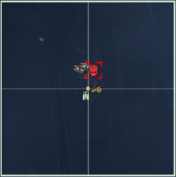 | 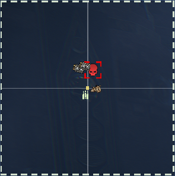 | 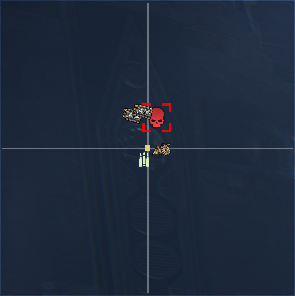 |
| View Guides | 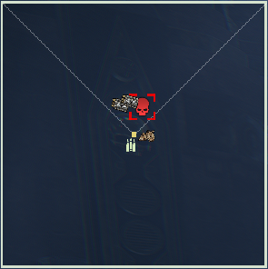 | 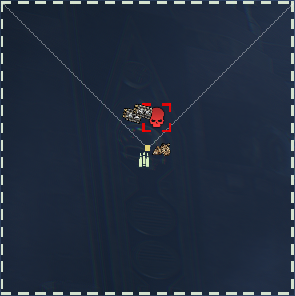 | 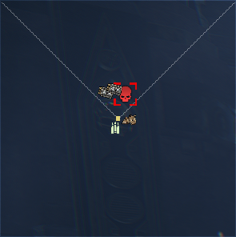 |
| Rings | 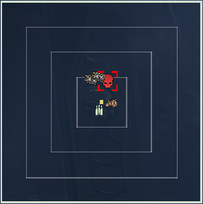 | 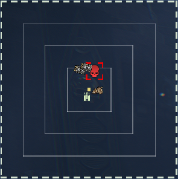 | 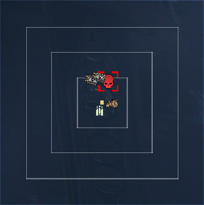 |
| Off | 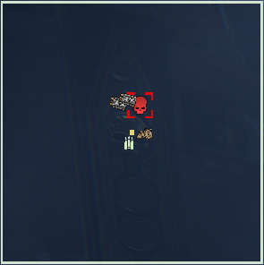 | 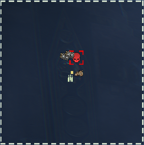 | 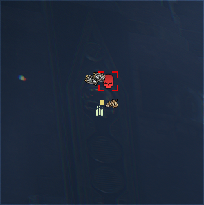 |

### Circle radar variants
| Guide | Solid | Dotted | Off |
|---|---|---|---|
| Crosshair | 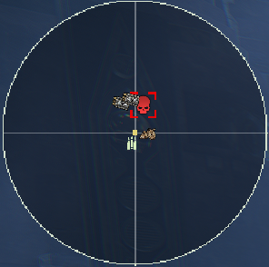 | 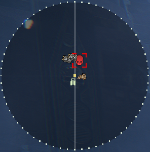 | 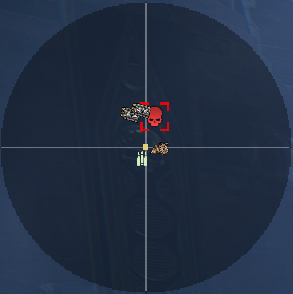 |
| View Guides | 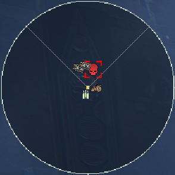 | 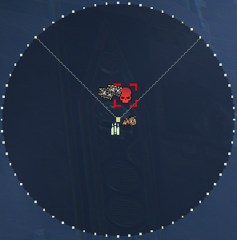 | 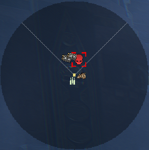 |
| Rings | 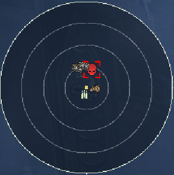 | 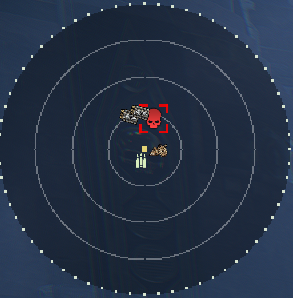 | 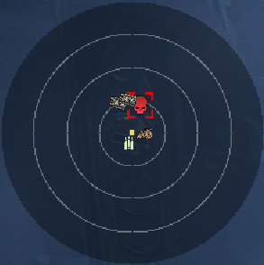 |
| Off | 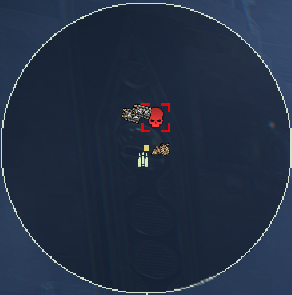 | 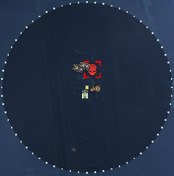 | 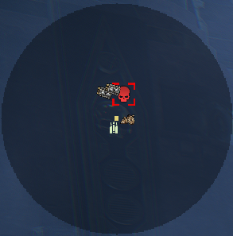 |

## Artwork, Icon, Off display modes

Supported artwork-based markers now use dropdowns instead of simple booleans. Each supported marker can be shown as **Artwork**, **Icon**, or **Off**.

- **Artwork** uses the original item artwork or pickup art.
- **Icon** uses a simplified HUD icon material with an ARGB tint.
- **Off** hides that specific marker entirely.
- Existing saved boolean settings are migrated automatically, with old `true` values becoming **Artwork** and old `false` values becoming **Off**.

### Common pickups and materials

| Marker | Artwork | Icon | Off |
| --- | --- | --- | --- |
| Crates | 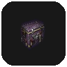 |  | Hidden |
| Diamantine | 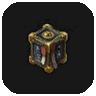 |  | Hidden |
| Plasteel | 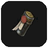 |  | Hidden |

### Expeditions-specific items with display modes

| Marker | Artwork | Icon | Off |
| --- | --- | --- | --- |
| Salvage | 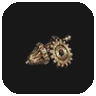 |  | Hidden |
| Tech-Remnants |  |  | Hidden |
| Dropped Tech-Remnants | 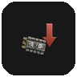 |  | Hidden |
| Servo-Triggered Mine |  |  | Hidden |
| Purgation Snare |  |  | Hidden |
| Voltaic Snare |  |  | Hidden |
| Void Shell |  |  | Hidden |
| Bombing Run Signal Marker | 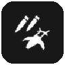 |  | Hidden |
| Artillery Locator Beacon | 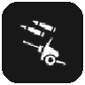 | 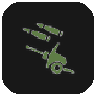 | Hidden |
| Modified Grenade |  |  | Hidden |
| Fire-Support Signal Marker |  |  | Hidden |

## Radar Controls

| Option | What it controls |
| --- | --- |
| Enable radar | Master on or off switch for the HUD element. |
| Toggle radar on or off | Assign a key to switch the radar HUD visibility during gameplay without opening the options menu. |
| Radar size | Adjustable from **100** to **1200**. |
| Radar range / filter distance | Adjustable from **25 m** to **100 m**. |
| Show vertical arrows within range (m) | Adjustable from **25 m** to **100 m**. Supported item markers show a small **up** or **down** arrow when they are on another level and still within this horizontal range. |
| Hide items above/below (m) | Adjustable from **8 m** to **50 m**. Supported item markers with a larger vertical separation are hidden. |
| Max radar markers | Adjustable from **10** to **100**. |
| Scale icons with radar size | Keeps marker size fixed or scales it with the radar. The final combined icon size is capped at **4.0x**. |
| Radar style | **Square** or **Circle**. |
| Radar outline | **Solid**, **Dotted**, or **Off**. |
| Radar guides | **Crosshair**, **View guides**, **Range rings**, or **Off**. |
| Radar background opacity | Adjustable from **0** to **255**. Controls the alpha of the radar background without changing marker readability. |
| Enemy marker style | **Icon only** or **Marked icon**. |
| Boss marker range | **Normal** or **Infinite**. Lets boss-type markers follow the normal radar range or stay visible at any distance. |
| Player marker style | **Icon only**, **Marked icon**, **Dot only**, or **Marked dot**. |
| Radar anchor | **Top left**, **Top right**, **Bottom left**, or **Bottom right**. Sets the corner the radar offsets from. |
| Horizontal offset | Sets the radar's horizontal offset from the selected anchor. The value is clamped to the visible UI space. |
| Vertical offset | Sets the radar's vertical offset from the selected anchor. The value is clamped to the visible UI space. |
| Steps per input | Sets how far each radar movement key press nudges the radar. |
| Move radar left | Assign a key to move the radar left by the configured step size. |
| Move radar right | Assign a key to move the radar right by the configured step size. |
| Move radar up | Assign a key to move the radar up by the configured step size. |
| Move radar down | Assign a key to move the radar down by the configured step size. |
| Highlight distance | Present in the options menu, but the highlighting feature is currently still under development. |

### Marker display mode controls

| Option group | Markers | Modes |
| --- | --- | --- |
| Common Pickups | Crates | **Artwork**, **Icon**, **Off** |
| Collectable Materials | Diamantine, Plasteel | **Artwork**, **Icon**, **Off** |
| Expeditions-Specific Items | Salvage, Tech-Remnants, Dropped Tech-Remnants, Servo-Triggered Mine, Purgation Snare, Voltaic Snare, Void Shell, Bombing Run Signal Marker, Artillery Locator Beacon, Modified Grenade, Fire-Support Signal Marker | **Artwork**, **Icon**, **Off** |

### Per-category icon size controls

Each major option group now includes an **Icon size (%)** slider. These sliders resize the whole marker family from **50%** to **300%**. When combined with **Scale icons with radar size**, the final rendered icon size is still capped at **4.0x**.

| Option group | Affects |
| --- | --- |
| Common Pickups | Crates, ammo, grenades, crates, and stimms |
| Collectable Materials | Diamantine and Plasteel |
| Primary Objective Items | Mission luggables and primary objective pickups |
| Secondary Objective Items | Grimoires and Scriptures |
| Expeditions POI | Sites of Interest, sanctuaries, harvesters, main objective, extraction, and arrival markers |
| Expeditions-Specific Items | Salvage, Tech-Remnants, expedition pocketables, and related expedition pickups |
| Martyr's Skull Items | Martyr's Skull markers and related power cell markers |
| Environment | Medicae Station, Power Socket, and Heretic Idol |
| Deployed Items | Ammo Crate and Medical Crate deployables |
| Enemies | Bosses, captains, and Karnak Twins markers |
| Players | Teammate markers |
| Event-Related Items | Event pickups and event objectives |
| Debugging | Unknown pickup markers and debug visuals |

### Expedition POI Controls

| Option | What it controls |
| --- | --- |
| Expeditions POI | Group of toggles for expedition location markers. |
| Ignore range limit for POI | Lets expedition POI markers bypass the normal radar range filter. |
| Sites of Interest | Shows registered expedition opportunity locations, including numbered scanner-map opportunity markers. |
| Deadsider Sanctuaries | Shows expedition transition or sanctuary locations with the dedicated transition icon. |
| Data Reliquary Harvesters | Shows expedition loot converters with the dedicated harvester icon while inside the sanctuary where they are usable. |
| Main Objective | Shows expedition main objective locations with the dedicated objective icon. |
| Valkyrie Extraction Zone | Shows extraction points with the dedicated extraction icon. |
| Valkyrie Arrival Zone | Shows arrival points with the dedicated arrival icon. |

### Environment Controls

| Option | What it controls |
| --- | --- |
| Environment | Group of toggles for interactable world objects that are useful to spot on the radar. |
| Medicae Station | Shows medicae station and equivalent health station interactions. |
| Power Socket | Shows luggable power socket targets. |
| Heretic Idol | Shows active heretic idols while they are still present. |

### Positioning and Toggle Use

- Use **Toggle radar on or off** to quickly hide or restore the radar while staying in the mission.
- Use **Radar anchor** first to choose the screen corner the radar should stick to.
- Use **Horizontal offset** and **Vertical offset** when you want to place the radar precisely relative to that anchor.
- Use **Move radar left**, **right**, **up**, and **down** when you want to fine-tune the placement in live gameplay with key presses.
- **Steps per input** controls how large each movement increment is, which makes it easier to do either quick repositioning or small adjustments.
- Anchor-based placement is automatically clamped against the current UI space, so the widget stays within the visible screen area even after changing size or resolution scale.

### Marker Rules

- **Enemies** use dedicated danger icons and, in marked mode, red bracket accents.
- **Teammates** use archetype icons or dot presentations, plus their runtime HUD slot color.
- **The center dot** uses the local player HUD color instead of a fixed green.
- **Supported artwork-based markers** can now switch between artwork mode, simplified icon mode, or be disabled entirely.
- **Supported item markers** can show a small **up** or **down** arrow when they are above or below you within the configured arrow range, and can be hidden entirely when they are too far above or below your level.
- **Environment markers** cover medicae stations, power sockets, and heretic idols, and active idols now appear reliably on the radar.
- **Boss markers** can follow the normal radar range or ignore it completely by switching **Boss marker range** to **Infinite**.
- **Expedition POIs** use numbered scanner-map glyphs for opportunity markers, can also reflect player-marked states in expedition colors, use dedicated icons for transition, harvester, main objective, extraction, and arrival locations, can optionally ignore the normal radar range limit, and are filtered to the active expedition section so outdated location markers do not linger after section changes.

## Target Markers

The legend below follows the option groups exposed by `Radar_data.lua`. The preview tiles were generated from the included `doc/img` assets and the ARGB values used by the HUD presentations.

### High-Priority Enemies

| Preview | Marker | Notes |
| --- | --- | --- |
|  | Daemonhost | Separate presentation under the **Monstrosities** toggle. |
|  | Monstrosities | Covers the generic monstrosity presentation used for Beast of Nurgle, Plague Ogryn, Chaos Spawn, and Ogryn Houndmaster. **Boss marker range** can be set to **Normal** or **Infinite**. |
| 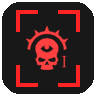 | Captains | Red danger marker with bracket accent in marked mode. |
| 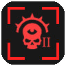 | Karnak Twins | Dedicated presentation for the twins. |

Display style example for enemy markers:

  
  

Left: **Icon only**. Right: **Marked icon**.

### Teammates

| Preview | Marker | Notes |
| --- | --- | --- |
|  | Teammates | Uses class icons, colored by teammate slot at runtime. Can be shown as **Icon only**, **Marked icon**, **Dot only**, or **Marked dot**. |

Display style example for teammate markers:

  
  
  
  

Left to right:
- **Icon only**
- **Marked icon**
- **Dot only**
- **Marked dot**

Supported class icon mappings in the HUD:

  

From left to right: **Veteran**, **Zealot**, **Psyker**, **Ogryn**, **Arbitrator**, **Hive Scum**.

### Common Pickups

| Preview | Marker | Notes |
| --- | --- | --- |
|  | Crates | Supports **Artwork**, **Icon**, and **Off**. Artwork keeps the pickup art, icon mode uses a simplified loot icon. |
| 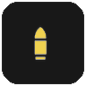 | Ammo Tin | Small ammo pickup, recolored with an ammo-specific yellow. |
|  | Ammo Stash | Large ammo pickup, recolored with an ammo-specific yellow. |
|  | Grenade | Uses a warm grenade-specific amber tint. |
|  | Ammo Crate | Pocketable ammo crate, recolored to match the ammo family. |
|  | Medical Crate | Pocketable medical crate with a medicae green tint. |
|  | Concentration Stimm | Recolored syringe template. |
|  | Med Stimm | Recolored syringe template. |
|  | Combat Stimm | Recolored syringe template. |
|  | Celerity Stimm | Recolored syringe template. |

### Collectable Materials

| Preview | Marker | Notes |
| --- | --- | --- |
|  | Diamantine | Supports **Artwork**, **Icon**, and **Off**. Icon mode uses a simplified blue material icon. |
|  | Plasteel | Supports **Artwork**, **Icon**, and **Off**. Icon mode uses a simplified steel-grey material icon. |

### Primary Objective Items

| Preview | Marker | Notes |
| --- | --- | --- |
|  | Power Cell | Teal luggable objective marker. |
|  | Cryonic Rod | Pale ice-blue luggable marker. |
|  | Moebian Pox Zetaphyte-13 Sample | Sickly green luggable marker. |
|  | Vacuum Capsule | Dark steel-grey luggable marker. |
|  | Special Issue Ammo | Olive-green luggable marker. |
|  | Prismata Crystal Repository | Bright red luggable marker. |
|  | Mortis Relic | Recolored device icon. |
|  | Coordinates | Uses the paper document icon. |

### Secondary Objective Items

| Preview | Marker | Notes |
| --- | --- | --- |
|  | Grimoire | Secondary objective pocketable. |
|  | Scripture | Secondary objective pocketable. |

### Expedition POIs

| Preview | Marker | Notes |
| --- | --- | --- |
|    | Sites of Interest | Unmarked expedition opportunity markers, using scanner-map glyphs with location numbering. |
|    | Sites of Interest, player-marked | Player-marked expedition opportunity markers, using the same glyph and number combinations with the expedition marked colors. |
|  | Deadsider Sanctuaries | Transition marker for sanctuary travel and section movement. |
|  | Data Reliquary Harvesters | Uses the expedition harvester icon and is only shown while inside the sanctuary where the converter is relevant. |
|  | Main Objective | Main expedition objective location marker. |
|  | Valkyrie Extraction Zone | Extraction location marker. |
|  | Valkyrie Arrival Zone | Arrival location marker. |

These markers are driven by expedition navigation data rather than standard pickup scanning. **Sites of Interest** can appear as unmarked opportunity markers or player-marked variants, while the remaining expedition POIs use dedicated objective-style icons. They can optionally ignore the normal radar range limit, are filtered to the currently active expedition section, and clear outdated location markers when the active section changes.

### Expeditions-Specific Items

| Preview | Marker | Notes |
| --- | --- | --- |
|  | Salvage | Supports **Artwork**, **Icon**, and **Off**. Artwork uses the salvage item art, icon mode uses a simplified salvage icon. |
|  | Tech-Remnants | Supports **Artwork**, **Icon**, and **Off**. |
|  | Dropped Tech-Remnants | Supports **Artwork**, **Icon**, and **Off**. Icon mode uses a red-tinted simplified icon to distinguish dropped loot. |
|  | Data Reliquaries | Gold luggable marker. |
|  | Servo-Triggered Mine | Supports **Artwork**, **Icon**, and **Off**. |
|  | Purgation Snare | Supports **Artwork**, **Icon**, and **Off**. |
|  | Voltaic Snare | Supports **Artwork**, **Icon**, and **Off**. |
|  | Void Shell | Supports **Artwork**, **Icon**, and **Off**. |
|  | Bombing Run Signal Marker | Supports **Artwork**, **Icon**, and **Off**. |
|  | Artillery Locator Beacon | Supports **Artwork**, **Icon**, and **Off**. |
|  | Modified Grenade | Supports **Artwork**, **Icon**, and **Off**. |
|  | Fire-Support Signal Marker | Supports **Artwork**, **Icon**, and **Off**. |
| 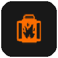 | Promethium Barrel | Orange explosive barrel marker. |
| 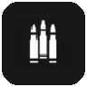 | Large Ammunition Crate | Large ammo container, recolored to match the ammo family. |
|  | Anti-Rad Stimms | Uses the expedition time syringe icon. |

### Martyr's Skull Items

| Preview | Marker | Notes |
| --- | --- | --- |
|  | Martyr's Skull | Gold skull marker. |
|  | Power Cell | Orange luggable marker used for the Martyr's Skull group. |

### Environment Markers

| Preview | Marker | Notes |
| --- | --- | --- |
|  | Medicae Station | Green medical interaction marker used for medicae stations and equivalent health-station interactions. |
|  | Power Socket | Yellow power socket marker for luggable socket targets. |
|  | Heretic Idol | Sickly green idol marker shown while the idol is still active. Active idols now appear reliably on the radar. |

### Deployed Items

| Preview | Marker | Notes |
| --- | --- | --- |
| 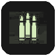 | Ammo Crate | Ammo-yellow deployable ammo crate marker. |
|  | Medical Crate | Green deployable medical crate marker. |

### Event-Related Items

| Preview | Marker | Notes |
| --- | --- | --- |
|  | Tainted Skulls | Green skull marker. |
|  | Tainted Communications Device | Orange auspex scanner marker. |
|  | Holy Relics | Gold relic marker. |
|  | Stolen Rations | Green crate marker. |

### Debug Marker

| Preview | Marker | Notes |
| --- | --- | --- |
|  | Unknown pickups | Optional fallback marker used when debug discovery is enabled. |

## Display Modes and Color Rules

The readme preview icons follow the HUD presentations used by the mod.

### Artwork mode

Artwork mode keeps the original item artwork for supported markers. This is the default mode for all markers that support the new display dropdowns.

Examples:
- Crates use the pickup artwork tile.
- Diamantine, Plasteel, Salvage, Tech-Remnants, and Dropped Tech-Remnants keep their resource artwork.
- Expeditions pocketables such as Void Shell, the landmines, and the strike markers keep their existing item artwork.

### Icon mode

Icon mode swaps supported markers to simplified HUD icon materials with dedicated ARGB colors.

| Marker family | Icon material | ARGB |
| --- | --- | --- |
| Crates | `content/ui/materials/icons/generic/loot` | `(255, 225, 200, 136)` |
| Diamantine | `content/ui/materials/hud/interactions/icons/environment_generic` | `(255, 70, 130, 220)` |
| Plasteel | `content/ui/materials/hud/interactions/icons/environment_generic` | `(255, 130, 135, 140)` |
| Salvage | `content/ui/materials/hud/interactions/icons/expeditions_salvage` | `(255, 120, 160, 140)` |
| Tech-Remnants | `content/ui/materials/hud/interactions/icons/expeditions_loot` | `(255, 192, 160, 0)` |
| Dropped Tech-Remnants | `content/ui/materials/hud/interactions/icons/expeditions_loot` | `(220, 255, 0, 0)` |
| Bombing Run Signal Marker | `content/ui/materials/hud/interactions/icons/valkyrie_payload` | `(255, 95, 125, 70)` |
| Artillery Locator Beacon | `content/ui/materials/hud/interactions/icons/artillery_strike` | `(255, 95, 125, 70)` |
| Modified Grenade | `content/ui/materials/hud/interactions/icons/big_fn_grenade` | `(255, 205, 156, 77)` |
| Fire-Support Signal Marker | `content/ui/materials/hud/interactions/icons/valkyrie_hover` | `(255, 95, 125, 70)` |
| Servo-Triggered Mine | `content/ui/materials/hud/interactions/icons/landmine_explosive` | `(255, 205, 156, 77)` |
| Purgation Snare | `content/ui/materials/hud/interactions/icons/landmine_fire` | `(255, 255, 110, 0)` |
| Voltaic Snare | `content/ui/materials/hud/interactions/icons/landmine_shock` | `(255, 80, 160, 255)` |
| Void Shell | `content/ui/materials/hud/interactions/icons/void_shield` | `(255, 181, 166, 66)` |

### Semantic recolors for regular markers

The remaining formerly white pickup icons were recolored so marker families read more clearly at a glance.

| Marker | ARGB | Note |
| --- | --- | --- |
| Ammo Tin | `(255, 240, 210, 80)` | Small ammo pickup |
| Ammo Stash | `(255, 240, 210, 80)` | Large ammo pickup |
| Large Ammunition Crate | `(255, 240, 210, 80)` | Expeditions ammo container |
| Deployable Ammo Crate | `(255, 240, 210, 80)` | Team deployable ammo |
| Grenade | `(255, 205, 156, 77)` | Grenade pickup |
| Pocketable Ammo Crate | `(255, 240, 210, 80)` | Ammo pickup family tint |
| Pocketable Medical Crate | `(255, 38, 205, 26)` | Medical supply tint |
| Medicae Station | `(255, 38, 205, 26)` | Environment medical interaction |
| Power Socket | `(255, 255, 245, 80)` | Environment power interaction |
| Heretic Idol | `(255, 150, 190, 60)` | Environment idol marker |

### Other recolored template families

| Base template | Variants in this readme | ARGB colors |
| --- | --- | --- |
| `content/ui/materials/icons/player_states/lugged` | Data Reliquary, Power Cell, Cryonic Rod, Moebian Pox Zetaphyte-13 Sample, Vacuum Capsule, Special Issue Ammo, Prismata Crystal Repository, Martyr's Skull Power Cell | `(255, 192, 160, 0)`, `(255, 0, 200, 200)`, `(255, 180, 220, 255)`, `(255, 150, 190, 60)`, `(255, 80, 85, 90)`, `(255, 95, 125, 70)`, `(255, 255, 70, 90)`, `(255, 255, 140, 0)` |
| `party_syringe` family | Concentration, Med, Combat, Celerity Stimms | `(255, 230, 192, 13)`, `(255, 38, 205, 26)`, `(255, 205, 51, 26)`, `(255, 0, 127, 218)` |
| Enemy accent brackets | Daemonhost, Monstrosity, Captain, Karnak Twins | `(220, 255, 0, 0)` |
| `content/ui/materials/icons/item_types/devices` | Mortis Relic | `(255, 110, 95, 125)` |
| `content/ui/materials/hud/interactions/icons/barrel_explosive` | Promethium Barrel | `(255, 255, 110, 0)` |
| `content/ui/materials/icons/circumstances/live_event_01` | Holy Relics | `(255, 192, 160, 0)` |
| `content/ui/materials/hud/interactions/icons/enemy` | Martyr's Skull, Tainted Skulls | `(255, 255, 215, 0)`, `(255, 150, 190, 60)` |

### Runtime-dynamic colors

Not every radar marker uses a fixed readme tint:

- **Teammates** use the class icon for the detected archetype and take their color from the active HUD slot color at runtime.
- **The radar center dot** also uses the local player's HUD color.

## Requirements

- **[Darktide Mod Framework](https://www.nexusmods.com/warhammer40kdarktide/mods/8)**
- **[Darktide Mod Loader](https://www.nexusmods.com/warhammer40kdarktide/mods/19)**

## Notes

- The radar is intended for active gameplay and suppresses itself outside valid runtime states such as hub and menu contexts.
- Expedition POIs are filtered to the active expedition section, and **Data Reliquary Harvesters** are only shown inside the relevant **Deadsider Sanctuary** where they can actually be used.
- Artwork-based markers now use localized **Artwork**, **Icon**, and **Off** dropdowns where supported, and older saved boolean settings are migrated automatically.
- Supported item markers can show vertical **up** and **down** arrows within the configured range, and can be hidden when they are too far above or below your current level.
- The **Environment** group adds dedicated toggles for **Medicae Station**, **Power Socket**, and **Heretic Idol**, and active heretic idols now appear reliably on the radar.
- Anchor-based positioning uses a corner anchor plus horizontal and vertical offsets, which makes radar placement more consistent across different screen layouts.
- Each major marker group now includes an **Icon size (%)** slider, and the final combined marker size is capped at **4.0x**.
- Boss markers can use **Normal** or **Infinite** range.
- The highlighting option is visible in the configuration, but the actual highlighting behavior is still work in progress.
- Marker previews in this readme were generated from the included template assets and documentation images so the legend matches the mod's configured presentations as closely as possible.
- The gameplay screenshots in this readme were captured during an expedition mission and show both radar frame styles in live use.
- Localization entries are included for the new positioning, icon size, vertical arrow, boss range, and background opacity settings, so the new options show up consistently with the rest of the translated mod menu.
