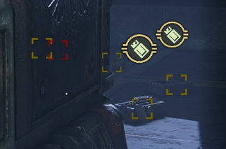
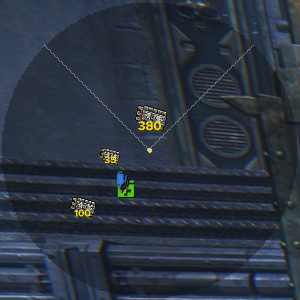

# Radar

Radar adds a compact, camera-oriented HUD radar for **Warhammer 40,000: Darktide**. It is built to surface the targets that matter most during live missions, nearby pickups, objective items, deployed support tools, environment interactables, expedition points of interest, teammates, and high-priority enemies, while keeping the presentation configurable from the mod options menu.

## What's New in 2.1.0

- Adds the new **Auspex** radar style, including an optional animated sweep, with documentation previews for the solid, dotted, off, and no-sweep variants. [PR #93](https://github.com/LucLeto/darktide-mods-radar/pull/93)
- Fixes radar visibility while the comms wheel is open, so the radar remains usable during live callouts. [PR #94](https://github.com/LucLeto/darktide-mods-radar/pull/94)
- Splits teammate visibility from the local player center dot, so both can now be toggled independently. [PR #95](https://github.com/LucLeto/darktide-mods-radar/pull/95)
- Adds radar support for player smart tags and pings, including dedicated display-style and distance-text settings. [PR #96](https://github.com/LucLeto/darktide-mods-radar/pull/96)
- Removes player tag elevation support from the radar to keep smart tag presentation cleaner and more predictable. [PR #97](https://github.com/LucLeto/darktide-mods-radar/pull/97)

**Full Changelog**: https://github.com/LucLeto/darktide-mods-radar/compare/Radar-2.0.2...Radar-2.1.0

## Feature Overview

- Tracks nearby pickups, materials, mission items, deployables, environment interactables, expedition POIs, teammates, player smart tags, and high-priority enemies on a single camera-oriented radar.
- Supports **Square**, **Circle**, and **Auspex** radar styles. Square and Circle use configurable **outline** and **guide** options, while **Auspex** adds an optional animated sweep.
- Lets you tune **radar size**, **range**, **background opacity**, **maximum marker count**, **nearby highlight range**, and supported vertical filtering behavior.
- Supports per-category **Icon size (%)** sliders across item, player, enemy, event, and debug marker groups, plus dedicated enemy sub-category scaling.
- Supports separate display controls for **bosses**, **enemy groups**, **teammates**, **player smart tags**, and the local **player center dot**.
- Includes a mission-ready **toggle radar on or off** keybind, plus per-mode enable toggles for **Regular Missions**, **Havoc**, **Mortis Trials**, and **Expeditions**.
- Supports anchor-based **radar positioning** with offsets, movement keybinds, configurable movement step size, and an optional unrestricted positioning fallback for ultrawide or advanced layouts.
- Supports **Artwork**, **Icon**, and **Off** display modes for the supported artwork-based pickup families, with automatic migration from older boolean settings.
- Adds optional nearby screen-space highlight brackets for supported non-enemy marker groups.
- Adds dedicated **Expedition POI** support for numbered **Sites of Interest**, **Deadsider Sanctuaries**, **Data Reliquary Harvesters**, **Main Objective**, **Valkyrie Extraction Zone**, and **Valkyrie Arrival Zone**.
- Supports tech-remnant loot modes for **Default**, **Scale by value**, and **Merge nearby piles**, plus optional cluster value text and radius tuning.
- Includes optional **boss distance text**, **Infinite** boss range, **debug logs**, and an **unknown pickups** toggle for discovery and troubleshooting.

## In-Game Radar Examples

The screenshots below show the live radar styles in gameplay. Together they illustrate the camera-oriented layout, mixed pickup categories, teammate markers, expedition POIs, smart tag support, and priority targets.

### Circle Radar

  
  
  

### Square Radar

  
  
  

### Auspex Radar

The new **Auspex** style provides a more diegetic scanner look. It supports the same gameplay marker data as the other radar styles, plus an optional animated sweep that can be disabled independently.

  
  
  
  

### Nearby highlight example

Nearby highlights add small screen-space brackets for supported non-enemy markers when they are close enough to matter. They reuse the marker family color and darken when the target is occluded.

  

### Vertical item arrows

The vertical item arrows add a small **up** or **down** overlay to supported item markers when the item is on a different level but still close enough horizontally to matter. You can also tune when these arrows appear and when vertically distant items are hidden entirely.

  
  
  

## Display and Behavior

**Square** and **Circle** radar styles support the same outline and guide options, and the frame rendering is tuned so crosshairs fit the active frame, view guides reach the border cleanly, circle range rings stay thin and solid, circle outlines remain visually continuous, and square dotted outlines render as proper dots.

The **Auspex** style is a separate presentation layer rather than another outline or guide combination. It uses its own frame treatment and can optionally render with an animated sweep.

### Square radar variants
| Guide | Solid | Dotted | Off |
|---|---|---|---|
| Crosshair |  |  |  |
| View Guides |  |  |  |
| Rings |  |  |  |
| Off |  |  |  |

### Circle radar variants
| Guide | Solid | Dotted | Off |
|---|---|---|---|
| Crosshair |  |  |  |
| View Guides |  |  |  |
| Rings |  |  |  |
| Off |  |  |  |

## Artwork, Icon, Off display modes

Supported artwork-based markers now use dropdowns instead of simple booleans. Each supported marker can be shown as **Artwork**, **Icon**, or **Off**.

- **Artwork** uses the original item artwork or pickup art.
- **Icon** uses a simplified HUD icon material with an ARGB tint.
- **Off** hides that specific marker entirely.
- Existing saved boolean settings are migrated automatically, with old `true` values becoming **Artwork** and old `false` values becoming **Off**.

### Common pickups and materials

| Marker | Artwork | Icon | Off |
| --- | --- | --- | --- |
| Crates |  |  | Hidden |
| Diamantine |  |  | Hidden |
| Plasteel |  |  | Hidden |

### Expeditions-specific items with display modes

| Marker | Artwork | Icon | Off |
| --- | --- | --- | --- |
| Salvage |  |  | Hidden |
| Tech-Remnants |  |  | Hidden |
| Dropped Tech-Remnants |  |  | Hidden |
| Servo-Triggered Mine |  |  | Hidden |
| Purgation Snare |  |  | Hidden |
| Voltaic Snare |  |  | Hidden |
| Void Shell |  |  | Hidden |
| Bombing Run Signal Marker |  |  | Hidden |
| Artillery Locator Beacon |  |  | Hidden |
| Modified Grenade |  |  | Hidden |
| Fire-Support Signal Marker |  |  | Hidden |

### Tech-Remnant cluster example

The example below shows **Tech-Remnant marker mode** set to **Merge nearby piles**. In this mode, nearby piles are combined into a single clustered radar marker, which helps reduce clutter in dense expedition loot areas.
Also for reference **Show tech-remnant value text** is set to **true**.

  

## Radar Controls

| Option | What it controls |
| --- | --- |
| Enable radar | Master on or off switch for the HUD element. |
| Enable in Regular Missions | Enables or disables the radar for standard mission runs. |
| Enable in Havoc | Enables or disables the radar in Havoc. |
| Enable in Mortis Trials | Enables or disables the radar in Mortis Trials. |
| Enable in Expeditions | Enables or disables the radar in Expeditions. |
| Toggle radar on or off | Assign a key to switch the radar HUD visibility during gameplay without opening the options menu. |
| Radar size | Adjustable from **100** to **1200**. |
| Radar range / filter distance | Adjustable from **25 m** to **100 m**. |
| Show vertical arrows within range (m) | Adjustable from **25 m** to **100 m**. Supported item markers show a small **up** or **down** arrow when they are on another level and still within this horizontal range. |
| Hide items above/below (m) | Adjustable from **8 m** to **50 m**. Supported item markers with a larger vertical separation are hidden. |
| Max radar markers | Adjustable from **10** to **200**. |
| Scale icons with radar size | Keeps marker size fixed or scales it with the radar. The final combined icon size is capped at **4.0x**. |
| Radar style | **Square**, **Circle**, or **Auspex**. |
| Radar outline | **Solid**, **Dotted**, or **Off**. Only used by the **Square** and **Circle** radar styles. |
| Radar guides | **Crosshair**, **View guides**, **Range rings**, or **Off**. Only used by the **Square** and **Circle** radar styles. |
| Radar background opacity | Adjustable from **0** to **255**. Controls the alpha of the radar background without changing marker readability. |
| Animated radar sweep | Enables or disables the animated sweep used by the **Auspex** radar style. |
| Nearby highlight range (m) | Adjustable from **5 m** to **20 m**. Controls how close supported items must be before their screen-space bracket highlights appear. |
| Boss marker style | **Icon only** or **Marked icon**. |
| Boss marker range | **Normal** or **Infinite**. Lets boss-type markers follow the normal radar range or stay visible at any distance. |
| Show boss distance text | Shows yellow distance text in meters for bosses except the daemonhost. |
| Teammates | Shows or hides teammate markers on the radar. |
| Player center dot | Shows or hides your own center point on the radar. |
| Player marker style | **Icon only**, **Marked icon**, **Dot only**, or **Marked dot**. |
| Player Tags | Shows or hides player smart tags and pings on the radar. |
| Show player tag distance text | Shows the current distance in meters next to player tag markers. |
| Player tag display style | **Icon only** or **Marked icon**. |
| Radar anchor | **Top left**, **Top right**, **Bottom left**, or **Bottom right**. Sets the corner the radar offsets from. |
| Allow unrestricted radar positioning | Removes the normal UI-space clamping fallback, which is useful for ultrawide or highly customized layouts. |
| Horizontal offset | Sets the radar's horizontal offset from the selected anchor. |
| Vertical offset | Sets the radar's vertical offset from the selected anchor. |
| Steps per input | Sets how far each radar movement key press nudges the radar. |
| Move radar left | Assign a key to move the radar left by the configured step size. |
| Move radar right | Assign a key to move the radar right by the configured step size. |
| Move radar up | Assign a key to move the radar up by the configured step size. |
| Move radar down | Assign a key to move the radar down by the configured step size. |

### Marker display mode controls

| Option group | Markers | Modes |
| --- | --- | --- |
| Common Pickups | Crates | **Artwork**, **Icon**, **Off** |
| Collectable Materials | Diamantine, Plasteel | **Artwork**, **Icon**, **Off** |
| Expeditions-Specific Items | Salvage, Tech-Remnants, Dropped Tech-Remnants, Servo-Triggered Mine, Purgation Snare, Voltaic Snare, Void Shell, Bombing Run Signal Marker, Artillery Locator Beacon, Modified Grenade, Fire-Support Signal Marker | **Artwork**, **Icon**, **Off** |
| Enemy bosses | Daemonhost, Monstrosities, Captains, Karnak Twins | **Icon only**, **Marked icon** |
| Enemy groups | Common enemies and Shooters | **Icon only**, **Marked icon**, **Off** |
| Individual enemy toggles | Elite, Special, and Misc enemies listed below | **Icon only**, **Marked icon**, **Off** |

### Per-category icon size controls

Each major option group now includes an **Icon size (%)** slider. These sliders resize the whole marker family from **50%** to **300%**. When combined with **Scale icons with radar size**, the final rendered icon size is still capped at **4.0x**.

| Option group | Affects |
| --- | --- |
| Common Pickups | Crates, ammo, grenades, portable crates, and stimms |
| Collectable Materials | Diamantine and Plasteel |
| Primary Objective Items | Mission luggables and primary objective pickups |
| Secondary Objective Items | Grimoires and Scriptures |
| Expeditions POI | Sites of Interest, sanctuaries, harvesters, main objective, extraction, and arrival markers |
| Expeditions-Specific Items | Salvage, Tech-Remnants, expedition pocketables, and related expedition pickups |
| Martyr's Skull Items | Martyr's Skull markers and related power cell markers |
| Environment | Medicae Station, Power Socket, and Heretic Idol |
| Deployed Items | Ammo Crate and Medical Crate deployables |
| Enemies | High-priority boss markers |
| Enemy Boss | Daemonhost, Monstrosities, Captains, Karnak Twins |
| Enemy Horde | Horde enemies |
| Enemy Common | Common enemies |
| Enemy Shooter | Shooter enemies |
| Enemy Elite | Elite enemies |
| Enemy Special | Special enemies |
| Enemy Misc | Ritualists |
| Players | Teammate markers |
| Event-Related Items | Event pickups and event objectives |
| Debugging | Unknown pickup markers and debug visuals |

### Enemy radar controls

| Option | What it controls |
| --- | --- |
| Monstrosities | Shows daemonhost and generic monstrosity markers. |
| Captains | Shows captain markers. |
| Karnak Twins | Shows the dedicated Karnak Twins marker. |
| Horde enemies | Single toggle for horde markers. Horde enemies stay on or off rather than using per-unit display modes. |
| Common enemies | Shared display-style dropdown for common enemy markers. |
| Shooters | Shared display-style dropdown for shooter enemy markers. |
| Elite enemies | Per-unit display-style dropdowns for Dreg Gunners, Ragers, Shotgunners, Scab Gunners, Maulers, Plasma Gunners, Ragers, Shotgunners, and Ogryn elites. |
| Special enemies | Per-unit display-style dropdowns for Bombers, Flamers, Mutants, Poxbursters, Hounds, Snipers, and Trappers. |
| Ritualist | Dedicated toggle under the misc enemy category. |

### Nearby highlight controls

| Option group | What it controls |
| --- | --- |
| Common Pickups | Highlights nearby ammo, grenades, crates, portable crates, and stimms. |
| Collectable Materials | Highlights nearby diamantine and plasteel. |
| Primary Objective Items | Highlights nearby mission luggables and main objective pickups. |
| Secondary Objective Items | Highlights nearby grimoires and scriptures. |
| Expeditions-Specific Items | Highlights nearby salvage, tech-remnants, expedition pocketables, and related expedition pickups. |
| Martyr's Skull Items | Highlights nearby martyr's skull items and their orange power cell markers. |
| Environment | Highlights nearby medicae stations, power sockets, and heretic idols. |
| Event-Related Items | Highlights nearby event pickups and event objectives. |

### Tech-Remnant controls

| Option | What it controls |
| --- | --- |
| Tech-Remnant marker mode | **Default**, **Scale by value**, or **Merge nearby piles**. |
| Show cluster value | Shows a value badge on clustered tech-remnant markers. |
| Cluster horizontal radius | Horizontal merge range for clustered tech-remnant markers. |
| Cluster vertical radius | Vertical merge range for clustered tech-remnant markers. |

### Expedition POI Controls

| Option | What it controls |
| --- | --- |
| Expeditions POI | Group of toggles for expedition location markers. |
| Ignore range limit for POI | Lets expedition POI markers bypass the normal radar range filter. |
| Sites of Interest | Shows registered expedition opportunity locations, including numbered scanner-map opportunity markers. |
| Deadsider Sanctuaries | Shows expedition transition or sanctuary locations with the dedicated transition icon. |
| Data Reliquary Harvesters | Shows expedition loot converters with the dedicated harvester icon while inside the sanctuary where they are usable. |
| Main Objective | Shows expedition main objective locations with the dedicated objective icon. |
| Valkyrie Extraction Zone | Shows extraction points with the dedicated extraction icon. |
| Valkyrie Arrival Zone | Shows arrival points with the dedicated arrival icon. |

### Environment Controls

| Option | What it controls |
| --- | --- |
| Environment | Group of toggles for interactable world objects that are useful to spot on the radar. |
| Medicae Station | Shows medicae station and equivalent health station interactions. |
| Power Socket | Shows luggable power socket targets. |
| Heretic Idol | Shows active heretic idols while they are still present. |

### Positioning and Toggle Use

- Use **Toggle radar on or off** for quick in-mission HUD control, or the per-mode enable toggles if you want Radar active only in selected activities.
- Use **Radar anchor**, **Horizontal offset**, and **Vertical offset** for stable placement, then fine-tune with the movement keybinds and **Steps per input**.
- Standard placement stays clamped to the visible UI space, while **Allow unrestricted radar positioning** is available for ultrawide or advanced layouts.

### Marker Rules

- **Enemies**, **teammates**, and **player smart tags** each use their own display rules and style settings. The local **center dot** also has its own toggle now.
- Supported item markers can show vertical **up** and **down** arrows, be hidden when vertical separation becomes too large, and use nearby highlight brackets when enabled.
- **Expedition POIs**, **environment markers**, and **tech-remnant clusters** follow their own category-specific rules so outdated markers clear correctly and context-sensitive markers only appear when relevant.

## Target Markers

The legend below follows the option groups exposed by `Radar_data.lua`. Enemy markers are listed in the same gameplay-oriented order used by the enemy settings: bosses, horde, common, shooters, elites, specials, and misc. The preview tiles were generated from the included `doc/img` assets and the ARGB values used by the HUD presentations.

### High-Priority Enemies

| Preview | Marker | Notes |
| --- | --- | --- |
|  | Daemonhost | Separate presentation under the **Monstrosities** toggle. It uses the boss marker style settings, but does **not** show boss distance text. |
|  | Monstrosities | Covers the generic monstrosity presentation used for Beast of Nurgle, Plague Ogryn, Chaos Spawn, and Ogryn Houndmaster. **Boss marker range** can be set to **Normal** or **Infinite**, and optional boss distance text is supported. |
|  | Captains | Red danger marker with bracket accent in marked mode. |
|  | Karnak Twins | Dedicated presentation for the twins. |

Display style example for boss and enemy markers:

  
  

Left: **Icon only**. Right: **Marked icon**.

### Horde Enemies

| Preview | Marker | Notes |
| --- | --- | --- |
|  | Horde enemies | Shared horde presentation used for Groaners, Moebian 21st infantry, Poxwalkers, lesser mutated poxwalkers, mutated poxwalkers, and related horde-only infected. Horde enemies use a single on or off toggle plus the **Enemy Horde** size slider. |

### Common Enemies

| Preview | Marker | Notes |
| --- | --- | --- |
|  | Dreg Bruiser | Uses the shared **Common enemies** display-style dropdown. |
|  | Scab Bruiser | Uses the shared **Common enemies** display-style dropdown. |

### Shooter Enemies

| Preview | Marker | Notes |
| --- | --- | --- |
|  | Dreg Stalker | Uses the shared **Shooters** display-style dropdown. |
|  | Scab Stalker | Uses the shared **Shooters** display-style dropdown. |
|  | Scab Shooter | Uses the shared **Shooters** display-style dropdown. |

### Elite Enemies

| Preview | Marker | Notes |
| --- | --- | --- |
|  | Dreg Gunner | Individual elite enemy toggle. |
|  | Dreg Rager | Individual elite enemy toggle. |
|  | Dreg Shotgunner | Individual elite enemy toggle. |
|  | Scab Gunner | Individual elite enemy toggle. |
|  | Scab Gunner, mutator variant | Uses the same toggle and scale settings as **Scab Gunner**. |
|  | Scab Mauler | Individual elite enemy toggle. |
|  | Scab Plasma Gunner | Individual elite enemy toggle. |
|  | Scab Rager | Individual elite enemy toggle. |
|  | Scab Shotgunner | Individual elite enemy toggle. |
|  | Ogryn - Bulwark | Individual elite enemy toggle. |
|  | Ogryn - Crusher | Individual elite enemy toggle. |
|  | Ogryn - Reaper | Individual elite enemy toggle. |

### Special Enemies

| Preview | Marker | Notes |
| --- | --- | --- |
|  | Scab Bomber | Individual special enemy toggle. |
|  | Dreg Tox Bomber | Individual special enemy toggle. |
|  | Scab Flamer | Individual special enemy toggle. |
|  | Scab Flamer, mutator variant | Uses the same toggle and scale settings as **Scab Flamer**. |
|  | Dreg Tox Flamer | Individual special enemy toggle. |
|  | Mutant | Individual special enemy toggle. |
|  | Pox Hound | Individual special enemy toggle. |
|  | Pox Hound, mutator variant | Uses the same toggle and scale settings as **Pox Hound**. |
|  | Armored Pox Hound | Individual special enemy toggle. |
|  | Poxburster | Individual special enemy toggle. The default display style is **Marked icon**. |
|  | Sniper | Individual special enemy toggle. |
|  | Trapper | Individual special enemy toggle. |

Poxburster style example:

  
  

Left: **Icon only**. Right: **Marked icon**.

### Misc Enemies

| Preview | Marker | Notes |
| --- | --- | --- |
|  | Ritualist | Dedicated misc enemy toggle with its own **Enemy Misc** size slider. |

### Teammates

| Preview | Marker | Notes |
| --- | --- | --- |
|  | Teammates | Uses class icons, colored by teammate slot at runtime. Can be shown as **Icon only**, **Marked icon**, **Dot only**, or **Marked dot**. Teammates can now be toggled independently from the local player center dot. |

Display style example for teammate markers:

  
  
  
  

Left to right:
- **Icon only**
- **Marked icon**
- **Dot only**
- **Marked dot**

Supported class icon mappings in the HUD:

  

From left to right: **Veteran**, **Zealot**, **Psyker**, **Ogryn**, **Arbitrator**, **Hive Scum**.

### Player Tags

| Preview | Marker | Notes |
| --- | --- | --- |
|  | Enemy | Radar support for enemy callout tags. Uses the dedicated **Player tag display style** setting and can optionally show distance text. |
|  | Go There | Radar support for movement and positioning callouts placed by players. |
|  | Look There | Radar support for attention and look-here callouts placed by players. |

Display style example for player tags:

| Tag | Icon only | Marked icon |
| --- | --- | --- |
| Enemy |  |  |
| Go There |  |  |
| Look There |  |  |

Player tags intentionally stay flatter and cleaner than supported item markers. They do not use the item-style elevation arrow presentation.

### Common Pickups

| Preview | Marker | Notes |
| --- | --- | --- |
|  | Crates | Supports **Artwork**, **Icon**, and **Off**. Artwork keeps the pickup art, icon mode uses a simplified loot icon. |
|  | Ammo Tin | Small ammo pickup, recolored with an ammo-specific yellow. |
|  | Ammo Stash | Large ammo pickup, recolored with an ammo-specific yellow. |
|  | Grenade | Uses a warm grenade-specific amber tint. |
|  | Ammo Crate | Pocketable ammo crate, recolored to match the ammo family. |
|  | Medical Crate | Pocketable medical crate with a medicae green tint. |
|  | Concentration Stimm | Recolored syringe template. |
|  | Med Stimm | Recolored syringe template. |
|  | Combat Stimm | Recolored syringe template. |
|  | Celerity Stimm | Recolored syringe template. |

### Collectable Materials

| Preview | Marker | Notes |
| --- | --- | --- |
|  | Diamantine | Supports **Artwork**, **Icon**, and **Off**. Icon mode uses a simplified blue material icon. |
|  | Plasteel | Supports **Artwork**, **Icon**, and **Off**. Icon mode uses a simplified steel-grey material icon. |

### Primary Objective Items

| Preview | Marker | Notes |
| --- | --- | --- |
|  | Power Cell | Teal luggable objective marker. |
|  | Cryonic Rod | Pale ice-blue luggable marker. |
|  | Moebian Pox Zetaphyte-13 Sample | Sickly green luggable marker. |
|  | Vacuum Capsule | Dark steel-grey luggable marker. |
|  | Special Issue Ammo | Olive-green luggable marker. |
|  | Prismata Crystal Repository | Bright red luggable marker. |
|  | Mortis Relic | Recolored device icon. |
|  | Coordinates | Uses the paper document icon. |

### Secondary Objective Items

| Preview | Marker | Notes |
| --- | --- | --- |
|  | Grimoire | Secondary objective pocketable. |
|  | Scripture | Secondary objective pocketable. |

### Expedition POIs

| Preview | Marker | Notes |
| --- | --- | --- |
|    | Sites of Interest | Unmarked expedition opportunity markers, using scanner-map glyphs with location numbering. |
|    | Sites of Interest, player-marked | Player-marked expedition opportunity markers, using the same glyph and number combinations with the expedition marked colors. |
|  | Deadsider Sanctuaries | Transition marker for sanctuary travel and section movement. |
|  | Data Reliquary Harvesters | Uses the expedition harvester icon and is only shown while inside the sanctuary where the converter is relevant. |
|  | Main Objective | Main expedition objective location marker. |
|  | Valkyrie Extraction Zone | Extraction location marker. |
|  | Valkyrie Arrival Zone | Arrival location marker. |

These markers are driven by expedition navigation data rather than standard pickup scanning. **Sites of Interest** can appear as unmarked opportunity markers or player-marked variants, while the remaining expedition POIs use dedicated objective-style icons. They can optionally ignore the normal radar range limit, are filtered to the currently active expedition section, and clear outdated location markers when the active section changes.

### Expeditions-Specific Items

| Preview | Marker | Notes |
| --- | --- | --- |
|  | Salvage | Supports **Artwork**, **Icon**, and **Off**. Artwork uses the salvage item art, icon mode uses a simplified salvage icon. |
|  | Tech-Remnants | Supports **Artwork**, **Icon**, and **Off**. |
|  | Dropped Tech-Remnants | Supports **Artwork**, **Icon**, and **Off**. Icon mode uses a red-tinted simplified icon to distinguish dropped loot. |
|  | Data Reliquaries | Gold luggable marker. |
|  | Servo-Triggered Mine | Supports **Artwork**, **Icon**, and **Off**. |
|  | Purgation Snare | Supports **Artwork**, **Icon**, and **Off**. |
|  | Voltaic Snare | Supports **Artwork**, **Icon**, and **Off**. |
|  | Void Shell | Supports **Artwork**, **Icon**, and **Off**. |
|  | Bombing Run Signal Marker | Supports **Artwork**, **Icon**, and **Off**. |
|  | Artillery Locator Beacon | Supports **Artwork**, **Icon**, and **Off**. |
|  | Modified Grenade | Supports **Artwork**, **Icon**, and **Off**. |
|  | Fire-Support Signal Marker | Supports **Artwork**, **Icon**, and **Off**. |
|  | Promethium Barrel | Orange explosive barrel marker. |
|  | Large Ammunition Crate | Large ammo container, recolored to match the ammo family. |
|  | Anti-Rad Stimms | Uses the expedition time syringe icon. |

### Martyr's Skull Items

| Preview | Marker | Notes |
| --- | --- | --- |
|  | Martyr's Skull | Gold skull marker. |
|  | Power Cell | Orange luggable marker used for the Martyr's Skull group. |

### Environment Markers

| Preview | Marker | Notes |
| --- | --- | --- |
|  | Medicae Station | Green medical interaction marker used for medicae stations and equivalent health-station interactions. |
|  | Power Socket | Yellow power socket marker for luggable socket targets. |
|  | Heretic Idol | Sickly green idol marker shown while the idol is still active. Active idols now appear reliably on the radar. |

### Deployed Items

| Preview | Marker | Notes |
| --- | --- | --- |
|  | Ammo Crate | Ammo-yellow deployable ammo crate marker. |
|  | Medical Crate | Green deployable medical crate marker. |

### Event-Related Items

| Preview | Marker | Notes |
| --- | --- | --- |
|  | Tainted Skulls | Green skull marker. |
|  | Tainted Communications Device | Orange auspex scanner marker. |
|  | Holy Relics | Gold relic marker. |
|  | Stolen Rations | Green crate marker. |

### Debug Marker

| Preview | Marker | Notes |
| --- | --- | --- |
|  | Unknown pickups | Optional fallback marker used when debug discovery is enabled. |

## Display Modes and Color Rules

The readme preview icons follow the HUD presentations used by the mod.

### Artwork mode

Artwork mode keeps the original item artwork for supported markers. This is the default mode for all markers that support the new display dropdowns.

Examples:
- Crates use the pickup artwork tile.
- Diamantine, Plasteel, Salvage, Tech-Remnants, and Dropped Tech-Remnants keep their resource artwork.
- Expeditions pocketables such as Void Shell, the landmines, and the strike markers keep their existing item artwork.

### Icon mode

Icon mode swaps supported markers to simplified HUD icon materials with dedicated ARGB colors.

| Marker family | Icon material | ARGB |
| --- | --- | --- |
| Crates | `content/ui/materials/icons/generic/loot` | `(255, 225, 200, 136)` |
| Diamantine | `content/ui/materials/hud/interactions/icons/environment_generic` | `(255, 70, 130, 220)` |
| Plasteel | `content/ui/materials/hud/interactions/icons/environment_generic` | `(255, 130, 135, 140)` |
| Salvage | `content/ui/materials/hud/interactions/icons/expeditions_salvage` | `(255, 120, 160, 140)` |
| Tech-Remnants | `content/ui/materials/hud/interactions/icons/expeditions_loot` | `(255, 192, 160, 0)` |
| Dropped Tech-Remnants | `content/ui/materials/hud/interactions/icons/expeditions_loot` | `(220, 255, 0, 0)` |
| Bombing Run Signal Marker | `content/ui/materials/hud/interactions/icons/valkyrie_payload` | `(255, 95, 125, 70)` |
| Artillery Locator Beacon | `content/ui/materials/hud/interactions/icons/artillery_strike` | `(255, 95, 125, 70)` |
| Modified Grenade | `content/ui/materials/hud/interactions/icons/big_fn_grenade` | `(255, 205, 156, 77)` |
| Fire-Support Signal Marker | `content/ui/materials/hud/interactions/icons/valkyrie_hover` | `(255, 95, 125, 70)` |
| Servo-Triggered Mine | `content/ui/materials/hud/interactions/icons/landmine_explosive` | `(255, 205, 156, 77)` |
| Purgation Snare | `content/ui/materials/hud/interactions/icons/landmine_fire` | `(255, 255, 110, 0)` |
| Voltaic Snare | `content/ui/materials/hud/interactions/icons/landmine_shock` | `(255, 80, 160, 255)` |
| Void Shell | `content/ui/materials/hud/interactions/icons/void_shield` | `(255, 181, 166, 66)` |

### Semantic recolors for regular markers

The remaining formerly white pickup icons were recolored so marker families read more clearly at a glance.

| Marker | ARGB | Note |
| --- | --- | --- |
| Ammo Tin | `(255, 240, 210, 80)` | Small ammo pickup |
| Ammo Stash | `(255, 240, 210, 80)` | Large ammo pickup |
| Large Ammunition Crate | `(255, 240, 210, 80)` | Expeditions ammo container |
| Deployable Ammo Crate | `(255, 240, 210, 80)` | Team deployable ammo |
| Grenade | `(255, 205, 156, 77)` | Grenade pickup |
| Pocketable Ammo Crate | `(255, 240, 210, 80)` | Ammo pickup family tint |
| Pocketable Medical Crate | `(255, 38, 205, 26)` | Medical supply tint |
| Medicae Station | `(255, 38, 205, 26)` | Environment medical interaction |
| Power Socket | `(255, 255, 245, 80)` | Environment power interaction |
| Heretic Idol | `(255, 150, 190, 60)` | Environment idol marker |

### Other recolored template families

| Base template | Variants in this readme | ARGB colors |
| --- | --- | --- |
| `content/ui/materials/icons/player_states/lugged` | Data Reliquary, Power Cell, Cryonic Rod, Moebian Pox Zetaphyte-13 Sample, Vacuum Capsule, Special Issue Ammo, Prismata Crystal Repository, Martyr's Skull Power Cell | `(255, 192, 160, 0)`, `(255, 0, 200, 200)`, `(255, 180, 220, 255)`, `(255, 150, 190, 60)`, `(255, 80, 85, 90)`, `(255, 95, 125, 70)`, `(255, 255, 70, 90)`, `(255, 255, 140, 0)` |
| `party_syringe` family | Concentration, Med, Combat, Celerity Stimms | `(255, 230, 192, 13)`, `(255, 38, 205, 26)`, `(255, 205, 51, 26)`, `(255, 0, 127, 218)` |
| Enemy marked backgrounds and brackets | Marked enemy presentations, including bosses and per-enemy radar markers | `(220, 255, 0, 0)` |
| `content/ui/materials/icons/item_types/devices` | Mortis Relic | `(255, 110, 95, 125)` |
| `content/ui/materials/hud/interactions/icons/barrel_explosive` | Promethium Barrel | `(255, 255, 110, 0)` |
| `content/ui/materials/icons/circumstances/live_event_01` | Holy Relics | `(255, 192, 160, 0)` |
| `content/ui/materials/hud/interactions/icons/enemy` | Martyr's Skull, Tainted Skulls | `(255, 255, 215, 0)`, `(255, 150, 190, 60)` |

### Runtime-dynamic colors

Not every radar marker uses a fixed readme tint:

- **Teammates** use the class icon for the detected archetype and take their color from the active HUD slot color at runtime.
- **The radar center dot** also uses the local player's HUD color.

## Requirements

- **[Darktide Mod Framework](https://www.nexusmods.com/warhammer40kdarktide/mods/8)**
- **[Darktide Mod Loader](https://www.nexusmods.com/warhammer40kdarktide/mods/19)**

## Notes

- The radar is intended for active gameplay and suppresses itself outside valid runtime states such as hub and menu contexts.
- The radar now remains visible while the comms wheel is open, which makes live callouts and tag placement easier to track.
- **Auspex** is a full radar style with an optional animated sweep, and the included documentation GIFs show the solid, dotted, off, and no-sweep variants.
- Teammates, the local player center dot, and player smart tags now have separate controls, so ally information can be tuned more precisely.
- Player smart tags support optional distance text, but no longer use player-tag elevation arrows or related elevation hiding behavior.
- Expedition POIs are filtered to the active expedition section, and **Data Reliquary Harvesters** are only shown inside the relevant **Deadsider Sanctuary** where they can actually be used.
- Marker previews in this readme were generated from the included template assets and documentation images so the legend matches the mod's configured presentations as closely as possible.
